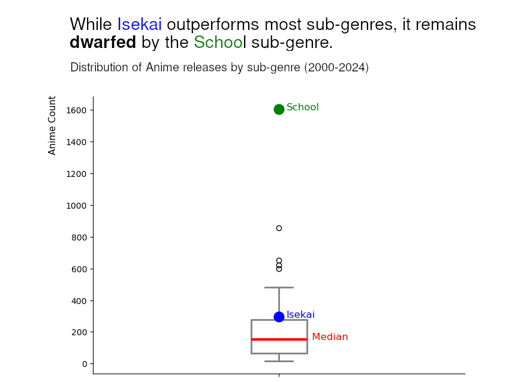
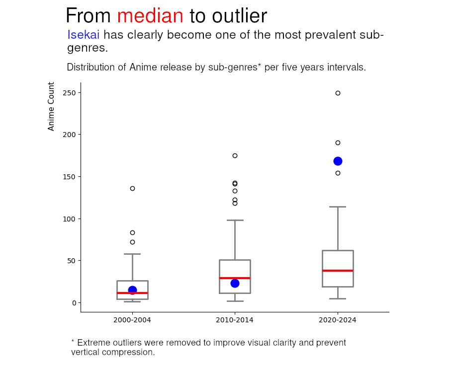
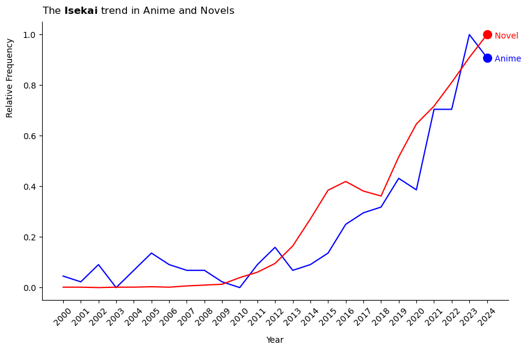
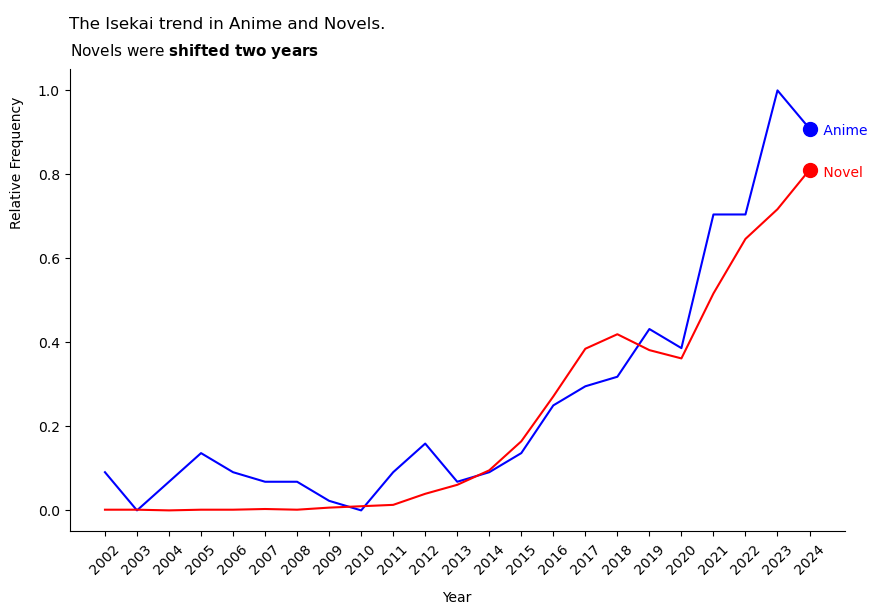

# Are there really that many Isekai?
**A Data Analysis by Andrés Ríos**

---
Did you know that the [Oxford English Dictionary](https://www.oed.com/dictionary/isekai_n) has its own section dedicated to *Isekai*?

In the last few years, Anime has taken over the world; moving from a niche subculture to a global reference, nowadays everyone knows what *Jujutsu Kaisen*, *Kimetsu no Yaiba*, or *Spyx Family* are. Whenever a new Anime film is released, theaters are filled with fans eager to see their favorite works on the big screen. Yet, in the midst of this Anime explosion, one particular sub-genre has been forging its own path

It's *now* a familiar formula: an unfortunate soul meets their end and is *reborn* into another world where they are a cheater—*who* wouldn't like that? Since 2020, Isekai has become one of the most popular sub-genres in this thriving industry, reaching a point where there is a feeling of *excess*, and that led me to a question: **Are there really that many Isekai, or does it just feel that way?**

## Key Objectives
For this analysis we focused on two main points to answer the question:

1. Has the Isekai genre had a considerable growth in this millennium?
2. Does Isekai represent an abnormal share of total anime production?

- ...and thirdly, to investigate a potential cause for this trend, provided the first two points yield a positive result

If you like, you may see the [methodology](../docs/methodology.md), the [limitations](../docs/limitations.md) and the [Isekai](../docs/isekai.md) definition for the scope of this analysis.

## Perception vs. Reality
### Has the Isekai genre had a considerable growth in this millennium?

Yes, it has... a lot. 

To put that growth into perspective: when comparing the period of 2000–2004 to 2020–2024, the number of releases grew by **1,020%**, an eleven-fold increase. Of course, this figure alone doesn't tell the whole story, as it could simply reflect the general expansion of the anime industry. To determine if this trend is truly unique, we must compare the Compound Annual Growth Rate (CAGR) of Isekai against the industry average.

With a CAGR of **11.03%** compared to the industry’s **6.3%**, Isekai is growing at nearly double the rate of anime as a whole. It is clear that this sub-genre is claiming an increasingly larger slice of total anime releases each year.

In the following chart, you can see this growth in market share visualized over the period.

As you can see in the chart, since reaching its lowest point in 2010, it **has grown almost exponentially**. It has more than **doubled** its market share since 2000, but is 10% truly significant, or is it relatively minor compared to other popular sub-genres?

### Does Isekai represent an abnormal share of total anime production?

This is relatively easy to answer, we need to compare Isekai's represetation against the other most prevalent sub-genres.

The most popular sub-genre since 2000 is School, with **1604** Anime released in the analysed period, almost duplicating the second most prevalent sub-genre. Thus, let's compare the Isekai share against School's. 

In the following chart, you can see a box plot representing the distribution of Isekai, School and the median of the sub-genres from 2000 to 2024.

As the chart demonstrates, even though Isekai outstrips the majority of genres, it pales in comparison to School and other dominant sub-genres. However, this cumulative data says little about the current market; since Isekai has grown primarily in the last few years, it is unlikely the trend remains unchanged, as its recent significance almost certainly outweighs its historical average.

The following chart presents three box plots partitioned into five-year intervals. It illustrates the statistical divergence of the Isekai sub-genre, showing its transition from a standard distribution in the early 2000s to a significant outlier in the current era.

When looking at the data in segments, it becomes clear how significant **Isekai** has become over the last five years. However, can this be considered an **abnormal** share? To determine this, we can compare it against the Interquartile Range (IQR).

While Isekai falls **2 IQR** above the third quartile, **School**—the most prevalent sub-genre in this timeframe—falls **5 IQR** above. This is more than double the statistical deviation of **Isekai**. Even when excluding the School sub-genre, there are **three** other sub-genres exhibiting greater statistical abnormality.

Thus, although Isekai is currently *one* of the most prevalent sub-genres, we cannot conclude that its share is "**abnormal**" when compared to other dominant sub-genres in the industry.

### Why
Although the second point didn't yield a positive result, we wanted to at least explore one of the possible reasons for this. Thus, here we are.

The foremost reason was clearly an **explosion** in the original source material, whether Manga or Light Novel.

First off, we would like to start by **ruling out** the possibility of manga. During the analysis, both Anime and Manga followed almost an identical trend, both in general and when looking specifically at the Isekai sub-genre. There did not seem to be any indicators or leads to suggest that one followed the other.

Furthermore, when looking at the distribution of sources for Isekai in the last five years, Light Novels represented more than **60%** of the source material, whereas in the industry Light Novel represents roughly 10%. Therefore, we can conclude that if the source influenced the growth in Anime, it can primarily be explained by **Light Novels**.

#### Light Novels.
It's essential to rule out the possibility of Isekai being already famous and relevant in Light Novels, as that would mean there is not more Anime Isekai due to a growth in Light Novels, but for other reasons.

When comparing the periods 2000-2004 and 2020-2024, the number of Light Novel releases grew by **19,400%** and Isekai by **61,975%**. Looking at those numbers, we can confirm that once again Isekai outpaced the general industry, and thus its relevance also grew.

Now, please look at the following chart. There you can see the Isekai growth trend in Anime and Light Novel.

With a positive correlation of **0.945**, the graph makes it evident that they are in sync, but how can we know if there is **causality**?

In their analysis, Hasegawa and Yamada[^1] found that between 2006 and 2015, the majority of Light Novels that received an anime adaptation were brought to the screen within **two years** of their original release. Therefore, if we shift the Light Novel data by two years and it shows an even greater correlation, we can be more certain that there is causality.

By applying a two-year time-lag shift, the correlation coefficient between Isekai Light Novels and Isekai Anime improved from 0.945 to **0.96**. This statistical tightening suggests that the surge in Isekai Anime is not merely an independent trend, but a direct downstream effect of the prior explosion in the Light Novel market. The data indicates that the growth in the Light Novel sector acted as the primary catalyst, with the Anime industry systematically adapting this specific surge in content after a standard two-year development delay.

## Conclusions
So, are there really that many Isekai, or does it just feel that way? After diving into the data, the answer is a bit of a "yes and no"—it depends on whether you are looking at growth or total market dominance.

- **The Growth is Real**: The feeling of "excess" is backed by data. With a 1,020% increase in releases since the early 2000s and a growth rate nearly double the industry average, Isekai has moved from a niche category to a dominant force.

- **It’s one of Them, Not the One**: While Isekai is a statistical outlier today, it isn't "abnormal" when compared to giants like the School sub-genre. It hasn't broken the industry; it has simply joined the top tier of most-produced themes.

**In Short**: While it likely began as a reaction to the growth in Light Novels, the major success of certain Anime titles undoubtedly spurred more Light Novels to be written. This has created a self-sustaining cycle: the proven success of previous Isekai Anime leads to more Light Novels being produced, which in turn leads to even more adaptations hitting our screens.

## References

[^1]: Hasegawa, S., Yamada, M. (2023). A Statistical Analysis of History of Japanese Light Novels. In: Mitsuo Nagamachi and Shigekazu Ishihara (eds) Kansei Engineering. AHFE (2023) International Conference. AHFE Open Access, vol 101. AHFE International, USA. http://doi.org/10.54941/ahfe1002996

